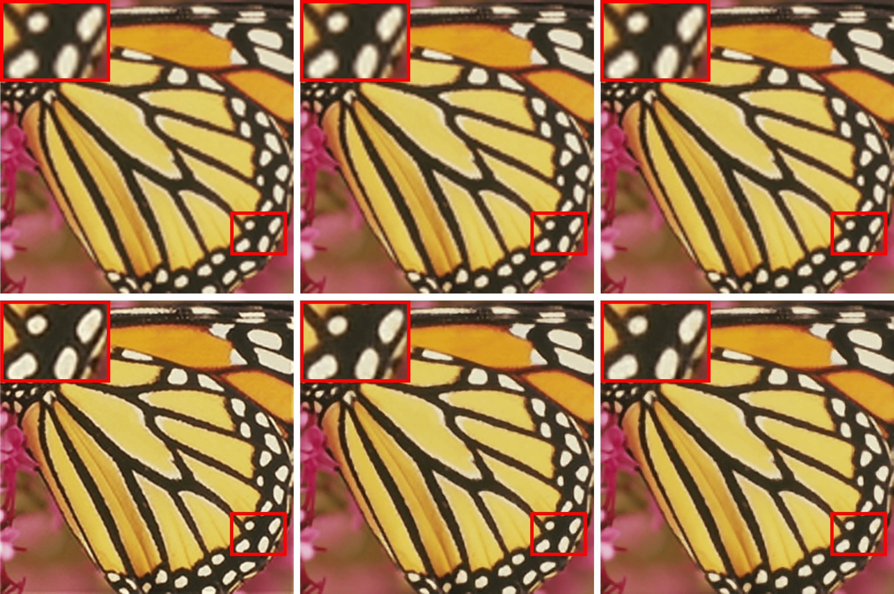
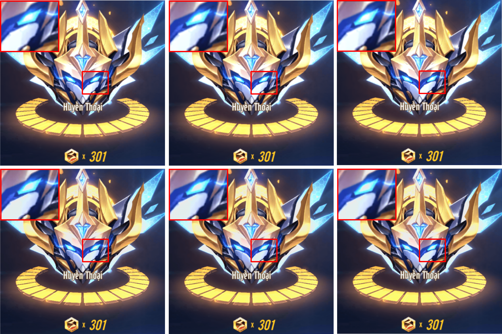

# ESPCN-TF

Implementation of ESPCN model in **Real-Time Single Image and Video Super-Resolution Using an Efficient Sub-Pixel Convolutional Neural Network** paper with Tensorflow 2x. 

I used Adam with optimize tuned hyperparameters instead of SGD + Momentum. 

I implemented 3 models in the paper, ESPCN-x2, ESPCN-x3, ESPCN-x4 


## Contents
- [Train](#train)
- [Demo](#demo)
- [References](#references)


## Train
You run this command to begin training:
```
python train.py  --steps=1000000             \
                 --scale=2                   \
                 --batch_size=128            \
                 --save-best-only=0          \
                 --save-every=1000           \
                 --ckpt-dir="checkpoint/x2"  
```
- **save-best-only**: if it is **0**, model weights will be saved every **save-every** steps.


**NOTE**: if you want to re-train a new model, you should delete all files in sub-directories in **checkpoint** directory. Your checkpoint will be saved when above command finishs and can be used for the next times, so you can train a model on Google Colab without taking care of GPU time limit.

I trained 3 models on Google Colab in 1000000 steps and you can get them here:
- [ESPCN-x2](checkpoint/x2/ESPCN-x2.h5)
- [ESPCN-x3](checkpoint/x3/ESPCN-x3.h5)
- [ESPCN-x4](checkpoint/x4/ESPCN-x4.h5)
- [Colab Notebook](https://colab.research.google.com/drive/1Z2CHYJvC_bs8-_CnGDwWv-Bg8ShzjDJE?usp=sharing)


## Demo 
After Training, you can test models with this command, the result is the **sr.png**.
```
python demo.py --image-path="/content/ESPCN-TF/dataset/test1.png"        \
               --ckpt-path="/content/ESPCN-TF/checkpoint/x2/ESPCN-x2.h5" \
               --scale=2
```

I evaluated models with Set5 and Set14 dataset by PSNR:

<div align="center">

|   Model  |  Set5   |  Set14  |
|:--------:|:-------:|:-------:|
| ESPCN-x2 | 31.3489 | 28.6103 |
| ESPCN-x3 | 28.5445 | 25.9767 |
| ESPCN-x4 | 26.5866 | 24.3839 |

</div>

<div align="center">
    
  <p><strong>Bicubic x2-x3-x4 (top), ESPCN x2-x3-x4 (bottom).</strong></p>

    
  <p><strong>Bicubic x2-x3-x4 (top), ESPCN x2-x3-x4 (bottom).</strong></p>
</div>
Source: game ZingSpeed Mobile

## References
- Real-Time Single Image and Video Super-Resolution Using an Efficient Sub-Pixel Convolutional Neural Network: https://arxiv.org/abs/1609.05158
- SunHays80: https://filebox.ece.vt.edu/~jbhuang/project/selfexsr/SunHays80_SR.zip
- Set5: https://filebox.ece.vt.edu/~jbhuang/project/selfexsr/Set5_SR.zip
- Set14: https://filebox.ece.vt.edu/~jbhuang/project/selfexsr/Set14_SR.zip
